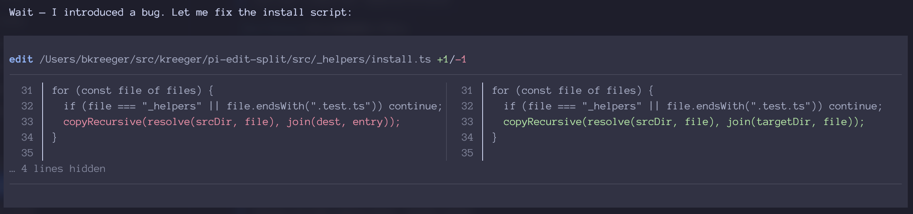
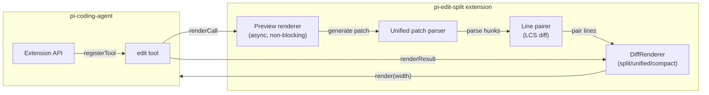

# pi-edit-split

A side-by-side diff preview for the pi-coding-agent `edit` tool. It shows
what changes will be made before they're applied, rendered as a split view
(old vs new) when your terminal is wide enough, or falling back to unified
and compact modes on narrower screens.

It uses fuzzy matching to handle typographic quotes, dashes, and spaces,
and strips UTF-8 BOM characters before processing. The preview computation
runs asynchronously and non-blocking.

## How it looks

The edit tool preview replaces pi's default diff output with a side-by-side
comparison. Context lines appear on both sides, removed lines in red on
the left, added lines in green on the right, and line numbers are shown
for reference.



## How it works



On tool registration, pi-edit-split wraps pi's built-in `edit` tool.
When the tool is called, it reads the target file, applies the edits
in-memory to generate a diff, and renders a live preview. The actual
file modification is delegated to pi's original edit tool execution.

Three rendering modes adapt to terminal width:

- **Split view** (width >= 120): Side-by-side old/new with a vertical
  divider. Each cell shows line numbers and content.
- **Unified diff** (width >= 80): Standard unified format, delegated
  to pi's built-in `renderDiff`.
- **Compact mode** (narrower): Minimal output with `+`/`-`/` ` prefixes
  and line numbers.

## Features

- **Side-by-side diff** — split view when terminal width >= 120 chars
- **Unified diff** — standard unified format when width >= 80 chars
- **Compact mode** — minimal output for narrow terminals
- **Fuzzy matching** — normalizes typographic quotes, dashes, and
  spaces for more reliable text matching
- **BOM handling** — strips UTF-8 BOM before processing
- **Async preview** — preview computation runs non-blocking
- **Collapsible hunks** — shows first change + context, hides the rest

## Installation

Install from the git repository using `pi install`:

```bash
pi install git@github.com:kreeger/pi-edit-split.git
```

Pass the repository URL directly as a single argument.

If you've cloned the repository locally, you can also install from
the local path:

```bash
pi install /path/to/pi-edit-split
```

After installation, restart your pi session. The edit preview appears
automatically — there's no activation step needed.

### Verify it is installed

```bash
ls ~/.pi/agent/extensions/pi-edit-split/
```

You should see TypeScript source files. The pi agent loads extensions
from this directory at startup.

## Configuration

No configuration needed — pi-edit-split activates automatically as a
drop-in replacement for the built-in edit tool renderer.

## Development

### Setup

Clone the repository and install dependencies:

```bash
git clone git@github.com:kreeger/pi-edit-split.git
cd pi-edit-split
npm install
```

### Running tests

```bash
npm test
```

Tests live alongside source files (`.test.ts`). They run with Vitest.
There are tests for the patch parser, line pairing (LCS diff), the
preview renderer, and the DiffRenderer component.

### Deploying your changes

The `deploy` script copies the source files (minus test files) to
`~/.pi/agent/extensions/pi-edit-split/`. Use it to push local changes
into pi without publishing to npm:

```bash
npm run deploy
```

Restart your pi session to pick up changes.

### Architecture notes

- `index.ts` — Extension entry point. Wraps pi's `edit` tool, wires up
  async preview computation, and renders the DiffRenderer component.
- `preview.ts` — Reads the target file, applies edits in-memory,
  generates a unified patch, and computes the preview result.
  Includes fuzzy text matching and BOM handling.
- `pairing.ts` — Lines the diff from two sides using LCS-based
  alignment. Groups consecutive removes and adds into matched pairs.
- `patch-parser.ts` — Parses unified diff hunks into structured
  `ParsedHunk` objects with line numbers and types.
- `diff-component.ts` — The TUI `Component` that renders the diff.
  Chooses split/unified/compact mode based on available width.
- `types.ts` — Shared TypeScript interfaces for hunks, lines, cells,
  rows, and preview state.

## License

MIT
