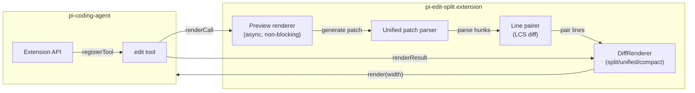

# pi-edit-split

A side-by-side diff preview for the pi-coding-agent `edit` tool. It
shows what changes will be made before they're applied, rendered as a
split view (old vs new) when your terminal is wide enough, or falling
back to unified/compact modes on narrower screens.

## How it looks

The edit tool preview replaces pi's default diff output with a
side-by-side comparison. Context lines appear on both sides, removed
lines in red on the left, added lines in green on the right, and
line numbers are shown for reference.


## How it works



On tool registration, pi-edit-split wraps pi's built-in `edit` tool.
When the tool is called, it reads the target file, applies the edits
in-memory to generate a diff, and renders a live preview. The actual
file modification is delegated to pi's original edit tool execution.

## Features

- **Side-by-side diff** — split view when terminal width ≥ 120 chars
- **Unified diff** — standard unified format when width ≥ 80 chars
- **Compact mode** — minimal output for narrow terminals
- **Fuzzy matching** — normalizes typographic quotes, dashes, and
  spaces for more reliable text matching
- **BOM handling** — strips UTF-8 BOM before processing
- **Async preview** — preview computation runs non-blocking
- **Collapsible hunks** — shows first change + context, hides the rest

## Installation

Install dependencies, then deploy:

```bash
npm install
npm run deploy
```

This copies the extension to `~/.pi/agent/extensions/pi-edit-split`.

## Configuration

No configuration needed — pi-edit-split activates automatically as a
drop-in replacement for the built-in edit tool renderer.
